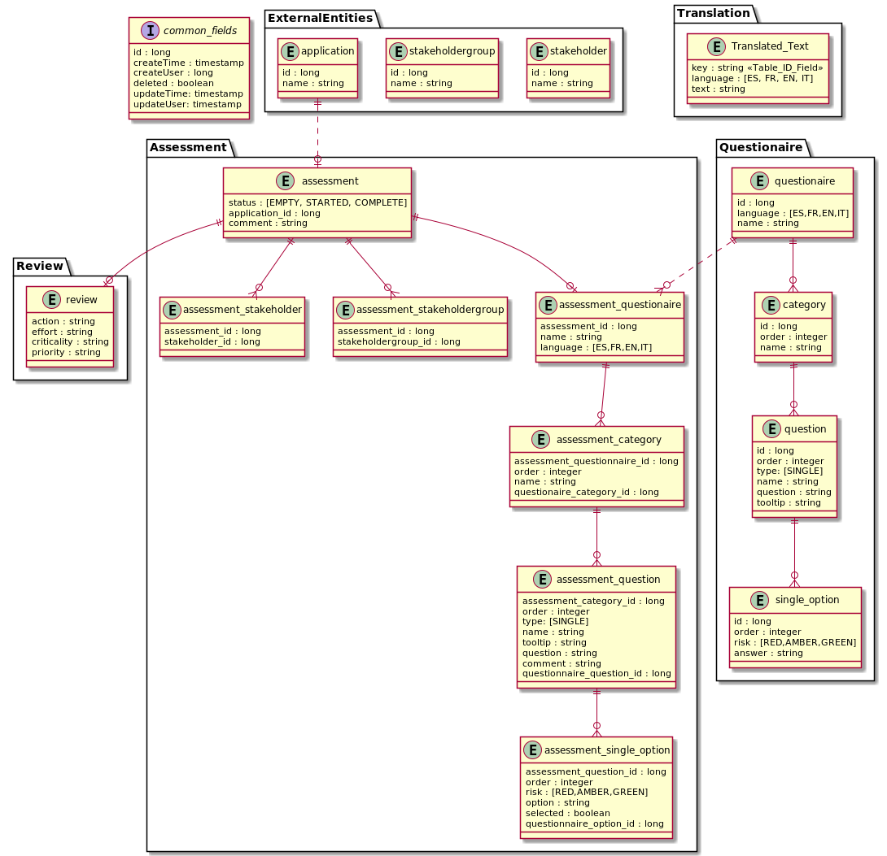

# Tackle Pathfinder application

It's the next version of the <https://github.com/redhat-cop/pathfinder> project.  

Pathfinder is an extensible, questionnaire based assessment tool for assessing the suitability of applications for deployment onto an enterprise Kubernetes platform.

# API

* use Apicurio to design de API first
* if the default docker-compose installation doesn't work ( for mysql issues) try full postgre approach ( <https://github.com/carlesarnal/apicurio-studio/tree/expand-docker-compose-db-choice-keycloak> )
* use Microcks to mock the API to test it and decouple Frontend from Backend

# LOGIC

## Assessment

## Questionaire Design

# MODEL

* flattened model (denormalised shcmema)

* initial premisses :
  * no dependency between questions
  * no mandatory/optional questions
  * no multichoice questions
  * i18n capabilities
  * 1 application -> 1 assessment
  * only 1 questionaire

# FLOW

| Assess Application | Copy Assessment |
| :------------------: | :---------------: |
 |  |
