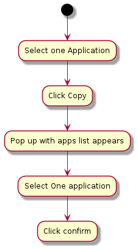

# Tackle Pathfinder application

It's the next version of the <https://github.com/redhat-cop/pathfinder> project.  

Pathfinder is an extensible, questionnaire based assessment tool for assessing the suitability of applications for deployment onto an enterprise Kubernetes platform.

## API

* use Apicurio to design de API first
* if the default docker-compose installation doesn't work ( for mysql issues) try full postgre approach ( <https://github.com/carlesarnal/apicurio-studio/tree/expand-docker-compose-db-choice-keycloak> )
* use Microcks to mock the API to test it and decouple Frontend from Backend

### Installation

1. in your cluster install microcks & apicurio operators
2. go to secrets , my-microcksinstall-keycloak-admin, copy username and password
3. go to keycloak route login using those credentials
4. got to view all suers and set the password for admin
5. go to microcks route and log with those credentials

### API Design

1. go to apicurio route
2. Open API , load the openapi.json file
3. Create/Edit the data types used by the operations
4. For each operation and verb generate the different Responses
5. For each response create examples ( these ones will be used by Microcks to generate the mocks )
   1. Generate 1 easy plain response
   2. Generate examples with Microcks [templating](https://microcks.io/documentation/using/advanced/templates/) to generate dynamic samples ( you can take a look to `GET info` operation )
6. Save as JSON overriding the openapi.json

### API Mocking

1. go to  microcks route
2. go to "Importers" menu
3. click "upload" the file openapi.json
4. microcks will store all the dispatchers configured and apply them as long as we don't change the name and version of the API
5. to export microcks configuration go to "Administration" menu, then "Snapshots" and then "Export"
6. to import microcks configuration go to "Administration" menu, then "Snapshots" and then "Import Snapshot....Browse"
7. these import/export actions should be done everytime your microcks installation is recreated

### API Testing

1. on Microcks , in every operation with sample responses, we'll find a `Mock URL`
2. use this URL to send the requests to

## LOGIC

### Assessment

### Questionaire Design

## MODEL

* flattened model (denormalised shcmema)

* initial premisses :
  * no dependency between questions
  * no mandatory/optional questions
  * no multichoice questions
  * i18n capabilities
  * 1 application -> 1 assessment
  * only 1 questionaire

## FLOW

| Assess Application | Copy Assessment |
| :------------------: | :---------------: |
 |  |
